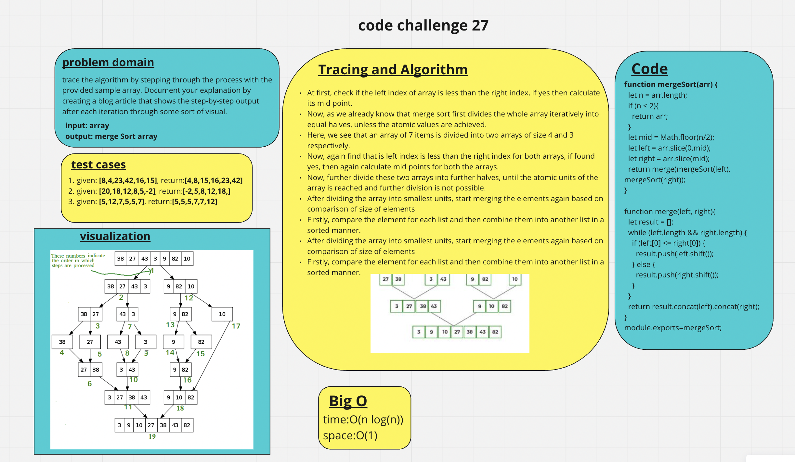
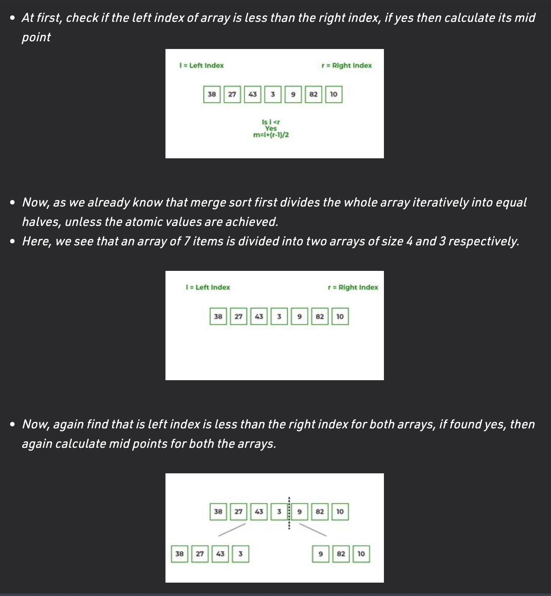
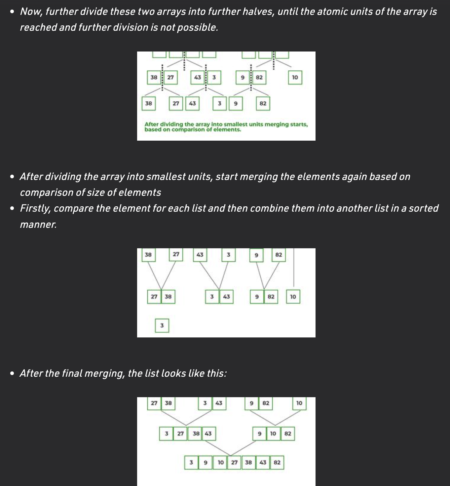
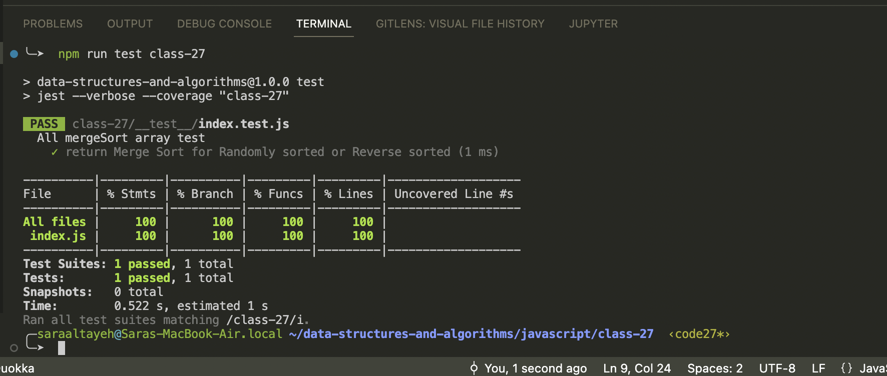

# Merge Sort

trace the algorithm by stepping through the process with the provided sample array. Document your explanation by creating a blog article that shows the step-by-step output after each iteration through some sort of visual.

## Whiteboard Process

## Tracing

## Approach & Efficiency

- Big O for space: O(n)
- Big O for time: O(n log(n))

## solution

