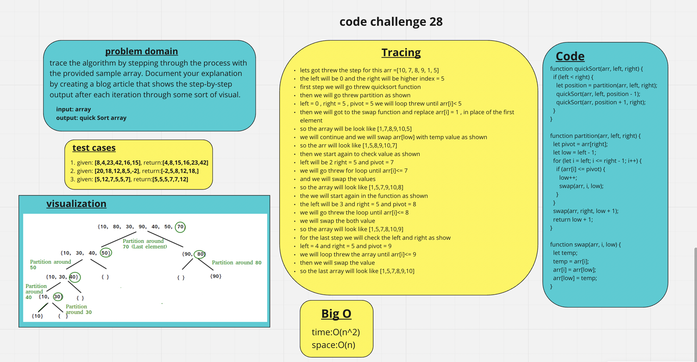
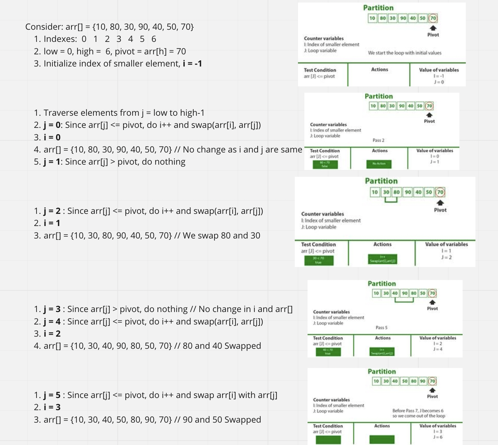
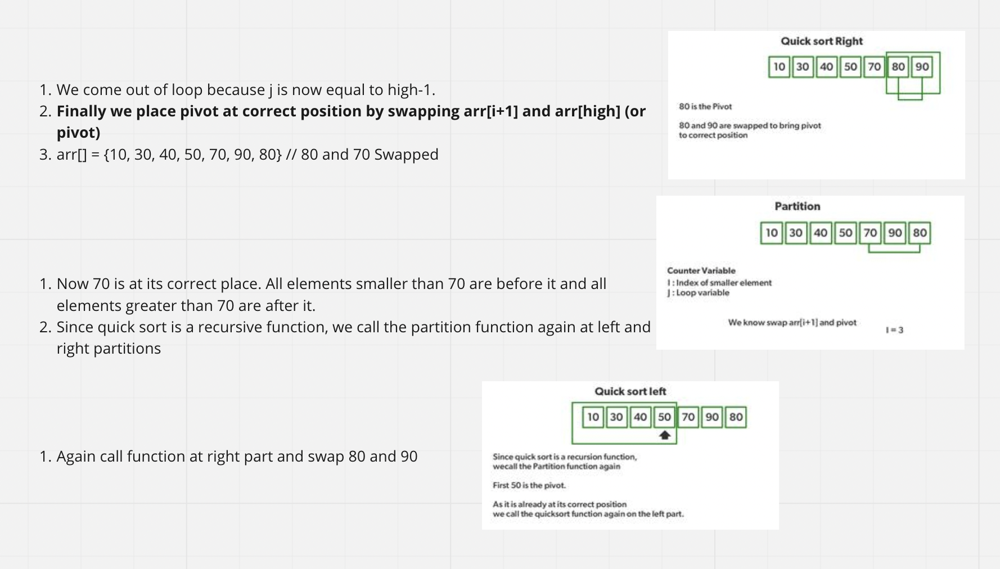
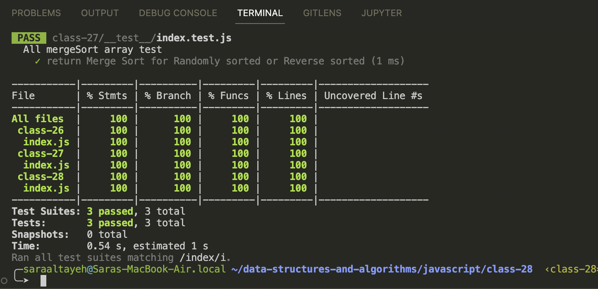
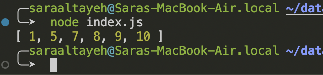

# Quick Sort

trace the algorithm by stepping through the process with the provided sample array. Document your explanation by creating a blog article that shows the step-by-step output after each iteration through some sort of visual.

Once you are done with your article, code a working, tested implementation of Quick Sort based on the pseudocode provided.

## Whiteboard Process

## Tracing

## Approach & Efficiency

- Big O for space: O(n)
- Big O for time: O(n^2)

## solution

