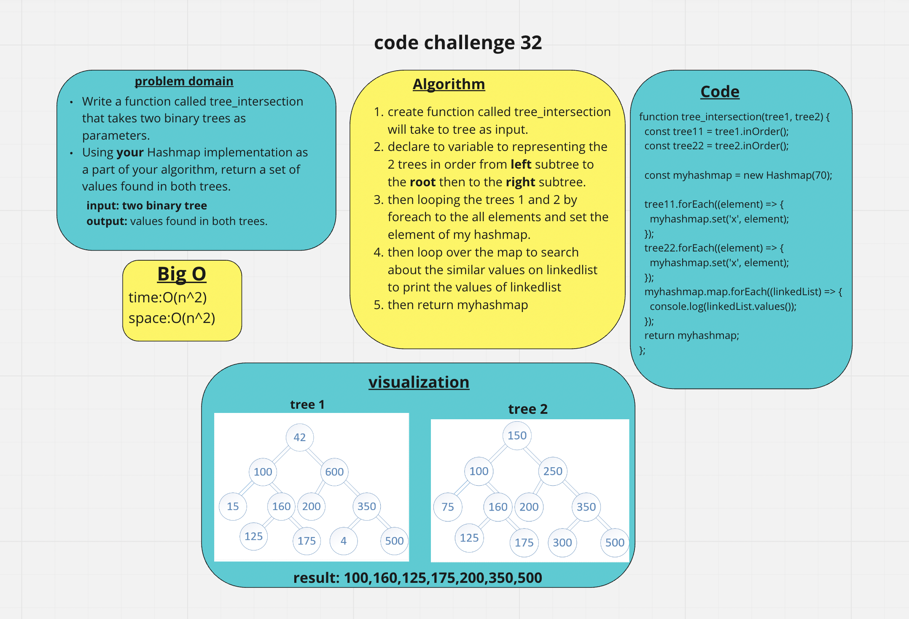
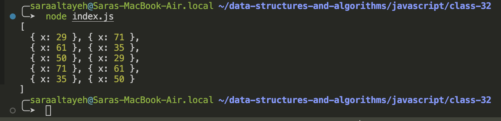

# tree-intersection

- Find common values in 2 binary trees.

Write a function called tree_intersection that takes two binary trees as parameters.
Using your Hashmap implementation as a part of your algorithm, return a set of values found in both trees.

## Whiteboard Process

## Approach & Efficiency

- Big O for space: O(n^2)
- Big O for time: O(n^2)

## Solution

