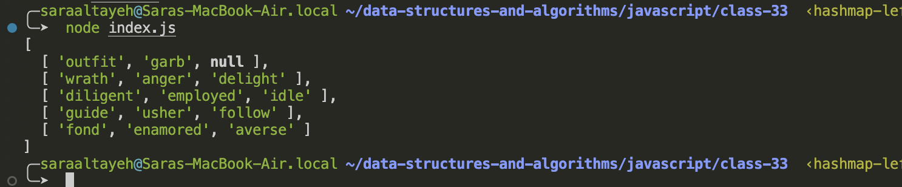
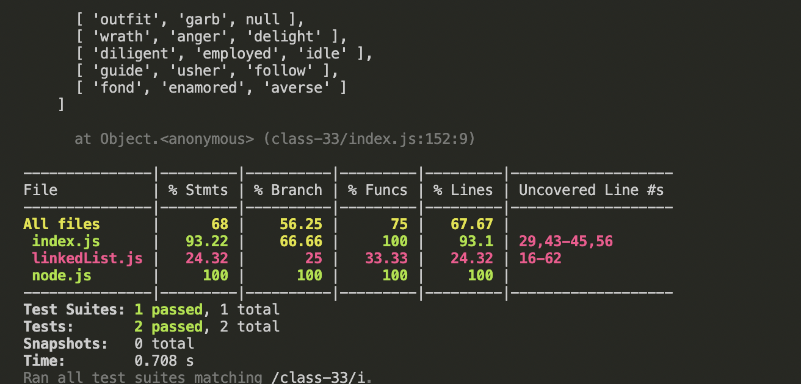

# hashmap-left-join

Hashtables: they are a data structure that utilize key value pairs. This means every Node or Bucket has both a key, and a value.

The basic idea of a hashtable is the ability to store the key into this data structure, and quickly retrieve the value. This is done through what we call a hash.

## Challenge

## Approach & Efficiency

- Big O for space: O(n)
- Big O for time: O(n)

## Solution

