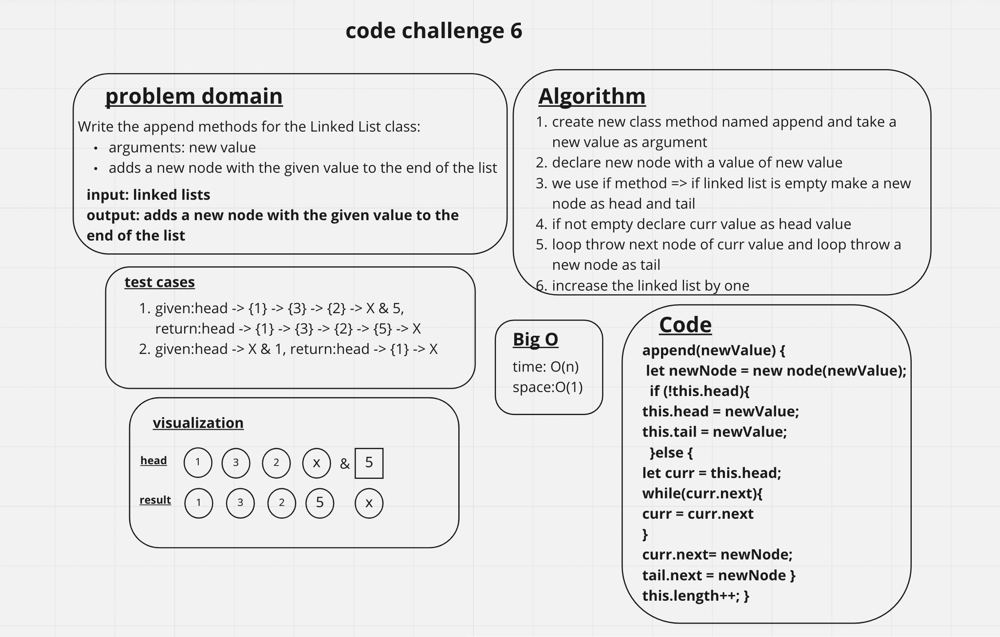

# linked-list-insertions

Extend a Linked List to allow various insertion methods.

## Whiteboard Process

## Approach & Efficiency

- append
arguments: new value
adds a new node with the given value to the end of the list

- insert before
arguments: value, new value
adds a new node with the given new value immediately before the first node that has the value specified

- insert after
arguments: value, new value
adds a new node with the given new value immediately after the first node that has the value specified

## Big O

time: O(n)
space:O(1)

## Solution

{1} -> {3} -> {2} -> {5} -> X
