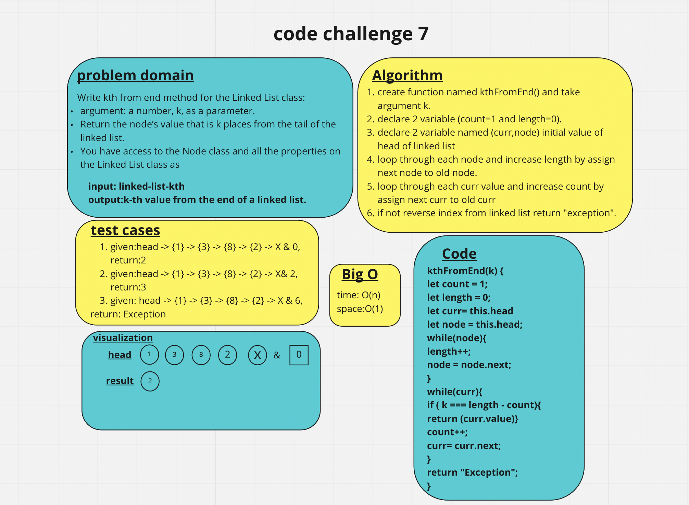

# linked-list-kth

Write kth from end method for the Linked List class:
argument: a number, k, as a parameter.
Return the node’s value that is k places from the tail of the linked list.
You have access to the Node class and all the properties on the Linked List class.

## Whiteboard Process

## Approach & Efficiency

- Big O
time: O(n)
space:O(1)

## Solution

kthFromEnd(k) {
let count = 1;
let length = 0;
let curr= this.head
let node = this.head;
while(node){
length++;
node = node.next;
}
while(curr){
if ( k === length - count){
return (curr.value)}
count++;
curr= curr.next;
}
return "Exception";
}
