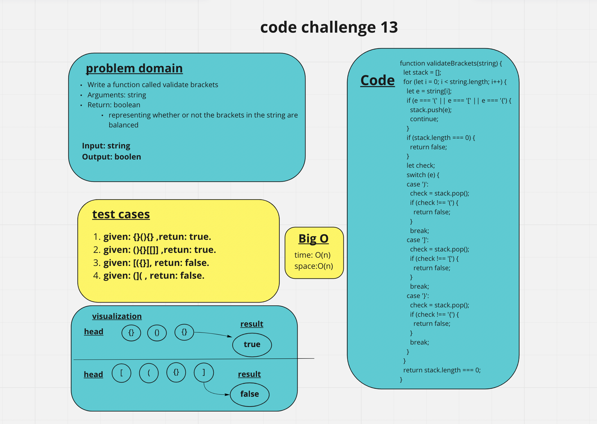

# stack-queue-brackets

Write a function called validate brackets
Arguments: string
Return: boolean
representing whether or not the brackets in the string are balanced
There are 3 types of brackets:

Round Brackets : ()
Square Brackets : []
Curly Brackets : {}

## whiteboard

## Approach & Efficiency

I used array method and the big O --> time: O(n), space: O(n).
