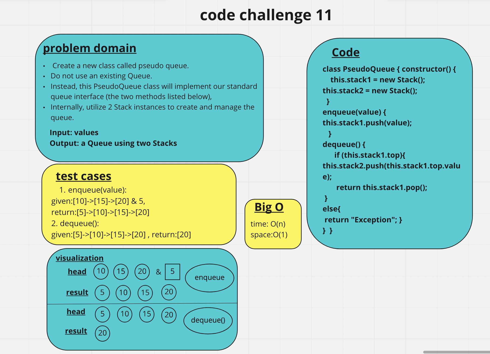

# stack-queue-pseudo

## Methods

- enqueue
Arguments: value
Inserts value into the PseudoQueue, using a first-in, first-out approach.
- dequeue
Arguments: none
Extracts a value from the PseudoQueue, using a first-in, first-out approach.

## Challenge

## Approach & Efficiency

I used class node and the big O --> time: O(1), space: O(1).
