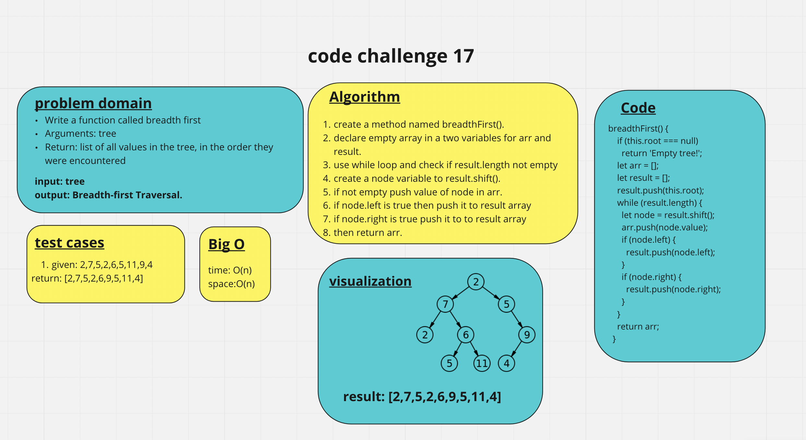

# tree-breadth-first*

Write a function called breadth first
Arguments: tree
Return: list of all values in the tree, in the order they were encountered.

## Challenge

## Approach & Efficiency

- the big O for space: O(n).
- the big O for time: O(n).
