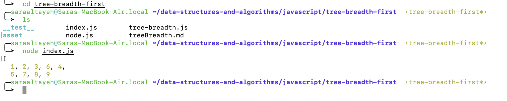

# tree-breadth-first*

Write a function called breadth first
Arguments: tree
Return: list of all values in the tree, in the order they were encountered.

## Challenge

updated code:

```
function breadthFirst(Tree) {
  if (Tree.root === null)
    return 'Empty tree!';
  let arr = [];
  let result = [];
  result.push(Tree.root);
  while (result.length) {
    let node = result.shift();
    arr.push(node.value);
    if (node.left) {
      result.push(node.left);
    }
    if (node.right) {
      result.push(node.right);
    }
  }
  return arr;
}
```




## Approach & Efficiency

- the big O for space: O(n).
- the big O for time: O(n).
