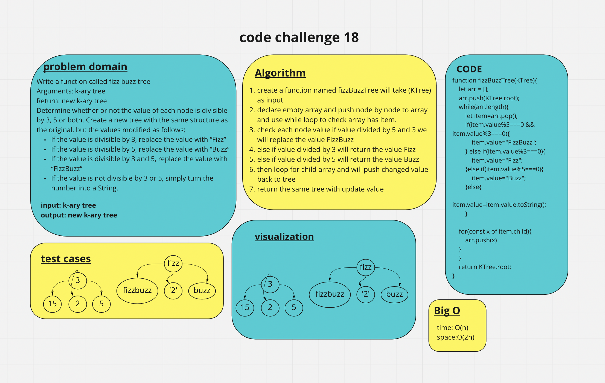

# tree-fizz-buzz

Conduct “FizzBuzz” on a k-ary tree while traversing through it to create a new tree.
Set the values of each of the new nodes depending on the corresponding node value in the source tree.

## Whiteboard Process

## Approach & Efficiency

Big O for time is O(n).
BigO for space is O(2n).

## Solution

The input will be a K-ary Tree
the output will be New K-ary Tree
